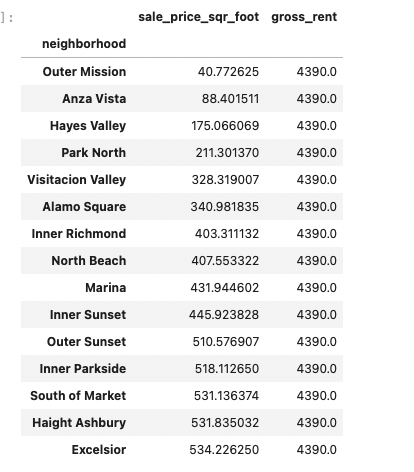

# sfo-real-estate
San Francisco Real Estate Analysis For Rental Opportunities
FinTech Challenge 6

---

## Analysis 

This is an anlysis of San Francisco housing data from 2010-2016. Specific areas looked at were housing units per year, average prices per sq ft, avg prices by neighborhood, along with interactive graphs and maps of this information by year and neighborhood.

See full analysis details in the notebook [san_francisco_housing.ipynb](./san_francisco_housing.ipynb)  


#### DataSets  

Two datasets were primary in creating the dataframes to anlyze this space:
- [sfo_neighborhoods_census_data.csv](./Resources/sfo_neighborhoods_census_data.csv) for historical sales information
    - contains data: `year | neighborhood | sale_price_sqr_foot | housing_units | gross_rent`
- [neighborhoods_coordinates.csv](./Resources/neighborhoods_coordinates.csv) for geolocation info used for plotting on map
    - contains data: `Neighborhood | Lat | Lon`

#### Assumptions
- The time period analyzed will be from 2010-2016.
- The mean() of the sale and rental prices will be used.
- Neighborhoods will be analyzed for changes in avg sale and rental prices by neighborhood.
- Neighborhoods will also be analyzed grouping by neighborhood, and aggregating by data across all the years to get a snapshot of pricing across the neighborhoods visually.


#### Summary

**Housing Supply:**  
The San Francisco area supply of housing units increased at a steady rate of approximately 2K units per year. Starting at `372560` in 2010, to `384242` in 2016. This is a total increase of `11,682` units, which is only a `3.1%` increase in supply over the 6-yr period.  

**Prices**  
The San francisco area housing prices also increased for sales and rentals, although at significantly different rates:  

**Sales**  
The avg sale price per sq ft increased from `$369` to `$697` from 2010-2016 across all neighborhoods. This is a total increase of `$328` per sq foot, a percent increase of `89%` in the cost to purchase.  

**Rentals**  
The avg gross rental price increased from `$1239` to `$4390` from 2010-2016 across all neighborhoods, which is a total increase of `$3151`, or a percent increase of `254%` in the cost to rent.  

**Neighborhoods**  
Across all neighborhoods, on average, the percent increase in rental prices is clearly outpacing the purchase price changes. Specifically, purchase costs have increased by `89%`, while rental costs have increased by `254`. Therefore, if this trend continues, one should be able to find opportunities in neighborhoods for renting out a purchased property.

Looking at specific neighborhoods over the time period shows that some neighborhoods sale_price decreased over the time period, while the rentals kept increased. One standout is **Anza Vista**, where the avg sale price dropped to `$88.402`, while the rental price kept increasing and was at `$4390` in 2016. This neighborhood may be an opportunity to pay less and rent for more.  Similarly, **Outer Mission** sale price decreased to `$40.77` in 2016. Another potential opportunity.  

In general, the neighborhoods with the lower/lowest sale price per sq ft, and the highest rents, look like potential opportunites to turn a purchase into a rental income, and I would advise looking into what purchases may be available there.  

In 2016, the avg gross rent is `$4390` across all neighborhoods. The charts below show the 15 lowest and highest sale price per sq foot in 2016. The neighborhoods which have the lowest sales price per sq foot should offer the widest margin between sale price, and avg gross rent, and be most likely to profit, even if the final rental price ends up a little lower than the avg of I would advise looking for opportunities in these neighborhoods.  

Here is a screen cap showing the decline in sale price for **Anza Vista** along with a chart of the 15 Neighborhoods with the lowest sale price as potential neighborhoods of interest in 2016.  





See full analysis implementation, interactive charts, and maps in the notebook [san_francisco_housing.ipynb](./san_francisco_housing.ipynb)  

---

## Technologies

This challenge uses [python](https://www.python.org/) 3.7 and the following [built-in](https://docs.python.org/3/py-modindex.html) modules:
- [os](https://docs.python.org/3/library/os.html#module-os)

Additionally, it requires:
- [matplotlib](https://matplotlib.org/)
- [pandas](https://pandas.pydata.org/)
- [JupyterLab](https://jupyterlab.readthedocs.io/en/stable/)
- [numpy](https://numpy.org/)
- [geoviews](https://geoviews.org/)
- [hvplot](https://hvplot.holoviz.org/)


See [installation](#installation) below for specifics.

---

## Installation

You will need Python 3.7, that supports for this application to run. An easy way to install python 3.7 is to download and install [Anaconda](https://www.anaconda.com/products/individual). After installing anaconda, open a terminal/command-prompt, and setup a python 3.7 environment, and then activate it like so:

```
# create an anaconda python 3.7 environment
# name can be any friendly name to refer to your environment, eg 'dev'
conda create --name dev python=3.7 anaconda

# activating the environment
conda activate dev

# use pip to install the above modules, eg:
pip install python-dotenv
...etc...
```


---

## Usage

The analysis is presented within a [JupyterLab](https://jupyterlab.readthedocs.io/en/stable/) notebook. To launch JupyterLab, from the root of this repo dirctory:

```
# within repo root 
$ jupyter lab --ContentsManager.allow_hidden=True
```
You can now open the notebook [san_francisco_housing.ipynb](./san_francisco_housing.ipynb) locally with JupyterLab.

---

## Contributors

[David Lopez](https://github.com/sububer)

---

## License

MIT